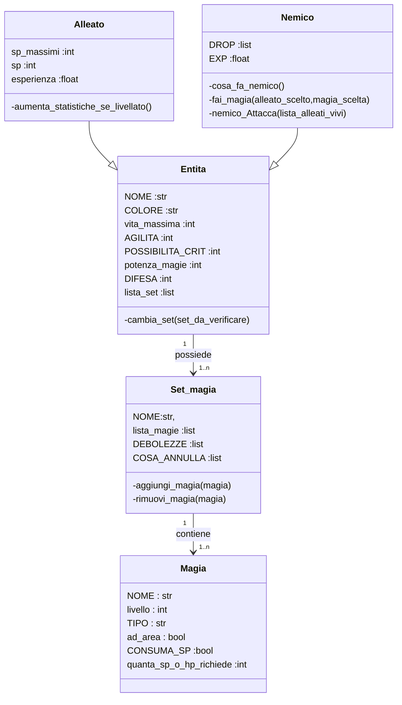

# *JRPG Holiday project*
this project is a remake of my first project.

the objective is to make it easier to read and improve some game mecanic,
and maybe i will add some grafic improvment
using the "py_cui" library.

### ONLY FOR NOW:
you don't need to install any library.

The **requirements.txt** file, will only be used for the final version of the game 

# HOW TO RUN THE PROJECT:
for now you don't have to use a **venv**, you only need to run the **main.py** file,

that is located in the ***code*** directory (it will change file path in future).
## Here is the game logic UML

# THE MEANING OF THE NAMES IN THE UML;
#TODO