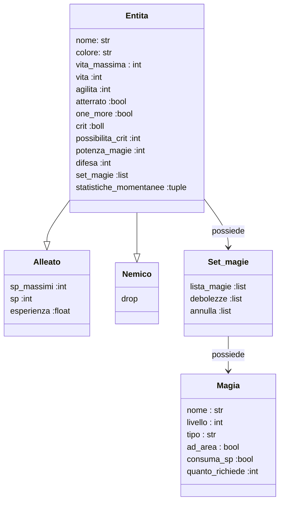

# *JRPG Holiday project*
this project is a remake of my first project.

the objective is to make it easier to read and improve some game mecanic,
and maybe i will add some grafic improvment
using the "py_cui" library.

## Here is the game logic UML



## COME ESEGIURE IL PROGRAMMA
**per prima cosa** si deve verificare se su visual studio si abbia creato una **venv** (virtual enviorment).

### **SOLO SE** non si ha un **venv**
scrivere su un **terminale** il seguente codice,

***al posto di .venv si può chiamarlo come si vuole, basta che DOPO si ricordi di mettere il nome che gli si ha assegnato***

```
python3.11 -m venv .venv
```
***il comando funziona solo in un terminale con python***

se non funziona verificare come si ha chiamato il file eseguibile di python e inserire quello al posto del ***python3.11***.

## DOPO AVER CREATO LA **venv**

```python
#windows
.venv\Scripts\activate

#linux
source .venv/bin/activate
```
