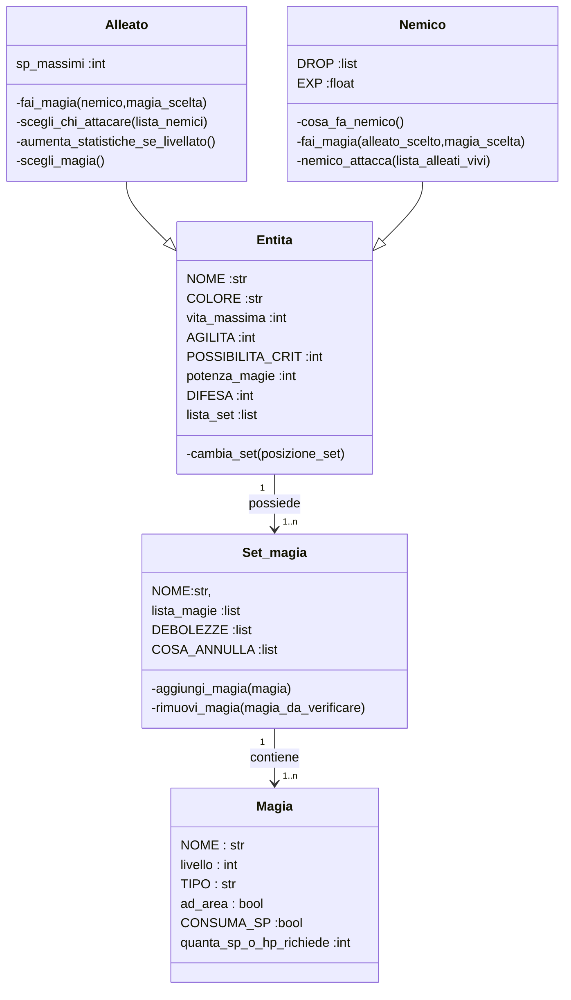

# *JRPG Holiday project*
this project is a remake of my first project.

the objective is to make it easier to read and improve some game mecanic,
and maybe i will add some grafic improvment
using the "py_cui" library.

### ONLY FOR NOW:
you don't need to install any library.

The **requirements.txt** file, will only be used for the final version of the game 

# HOW TO RUN THE PROJECT:
for now you don't have to use a **venv**, you only need to run the **main.py** file,

that is located in the ***code*** directory (it will change file path in future).
## Here is the game logic UML


# THE MEANING OF THE NAMES IN THE UML;
# || "Entita";
This class is used for creating entity in the game.

This class is used only for not repeating all the same stuff that *"nemici"* and *"alleato"* have.

So if you want to modified the code use only the classes *"nemici"* and *"alleato"*.
## | NOME :str
*"nome"* is used for giving a name for an enemy or a player.

## | COLORE :str
*"COLORE"* is work in progress, the concept is that you give a string type input with a specific color name, the player or enemy in the CUI will print with that colour inserted
## | vita_massima :int
*"vita_massima"* contains the maximum health of a player or enemy.
## | AGILITA :int
*"AGILITA"* is the % possibility of evading an attack,

if you want 30% possibility of evading an attack, you should use it like this;
```python
# when you create a player...
osuba = Alleato(
    NOME = "OSUBA",
    COLORE = "YELLOW",
    vita_massima = 200,
    AGILITA = 30, #this means 30% of possibility of ...
    POSSIBILITA_CRIT = 20, #this means 20% of possibility of ...
    potenza_magie = 15,
    DIFESA = 10,
    lista_set = lista_set_osuba,
    sp_massimi = 40,
)
```
## | POSSIBILITA_CRIT :int
*"POSSIBILITA_CRIT"* work the same way of *"AGILITA"* but it change the possibility of critting an enemy or a player,

crititting cause an "one more" (work in progress concept).
## | potenza_magie :int
*"potenza_magie"* work the same way of *"AGILITA"* but it change the ammount of damage dealed (it isn't scaled as an % value).

## | DIFESA :int
same as *"potenza_magie"* but it reduce the damage taken for enemy.

## | lista_set :list
"*lista_set*" is a list of "set" that the player can switch at any turn.

In game if "**CAMBIA SET**" is used you switch set, but you also make the turn pass.

# || alleato(Entita);
## | sp_massimi
"*sp_massimi*" is the maximum SP that a player have,

| if you somehow don't know what sp are;
SP are the "energy" that the player have, it is consumed by using spels,

SP don't recharge automaticly, it recharge (not complitly) by using item or by icreasing the max sp of a player (caused by leveling up)
# || "Set_magia";
"*lista_set*" contains (1..n) "*Set_magia*",

"*Set_magia*" is equipped by the player and contains a list of spell (*lista_magie*) that the player can cast by selecting "**MAGIA**".

The player can ONLY use spells that is contained in the current selected set ("*Set_magia*")


