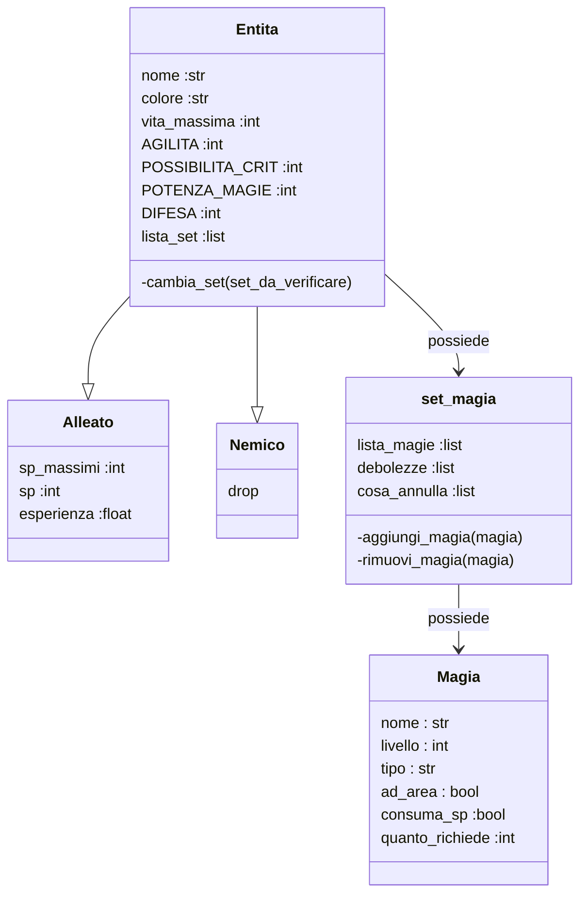

```mermaid
classDiagram
Entita --|> Alleato
Entita --|> Nemico
Entita --> set_magia :possiede
set_magia --> Magia :possiede

class Entita {
    nome :str
    colore :str
    vita_massima :int
    AGILITA :int
    POSSIBILITA_CRIT :int
    POTENZA_MAGIE :int
    DIFESA :int
    lista_set :list
    -cambia_set(set_da_verificare)
}

class Alleato {
    sp_massimi :int
    sp :int
    esperienza :float
}

class Nemico{
    drop
}

class set_magia {
    lista_magie :list
    debolezze :list
    cosa_annulla :list
    -aggiungi_magia(magia)
    -rimuovi_magia(magia)
}

class Magia {
    nome : str
    livello : int
    tipo : str
    ad_area : bool
    consuma_sp :bool
    quanto_richiede :int
}
```