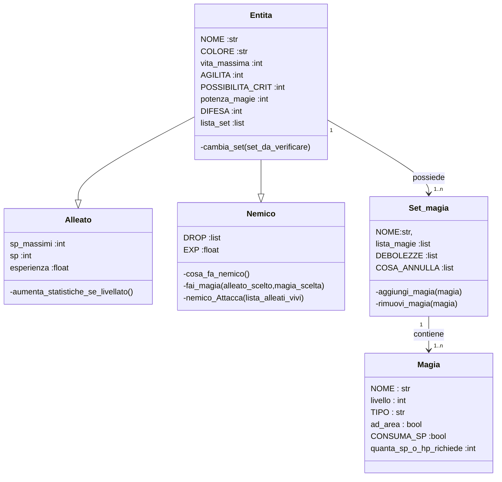

```mermaid
classDiagram
Entita --|> Alleato
Entita --|> Nemico
Entita "1"--> "1..n" Set_magia :possiede
Set_magia "1" --> "1..n" Magia :contiene

class Entita {
    NOME :str
    COLORE :str
    vita_massima :int
    AGILITA :int
    POSSIBILITA_CRIT :int
    potenza_magie :int
    DIFESA :int
    lista_set :list
    -cambia_set(set_da_verificare)
}

class Alleato {
    sp_massimi :int
    sp :int
    esperienza :float
    -aumenta_statistiche_se_livellato()
}

class Nemico{
    DROP :list
    EXP :float
    -cosa_fa_nemico()
    -fai_magia(alleato_scelto,magia_scelta)
    -nemico_Attacca(lista_alleati_vivi)
}

class Set_magia {
    NOME:str,
    lista_magie :list
    DEBOLEZZE :list
    COSA_ANNULLA :list
    -aggiungi_magia(magia)
    -rimuovi_magia(magia)
}

class Magia {
    NOME : str
    livello : int
    TIPO : str
    ad_area : bool
    CONSUMA_SP :bool
    quanta_sp_o_hp_richiede :int
    
}
```