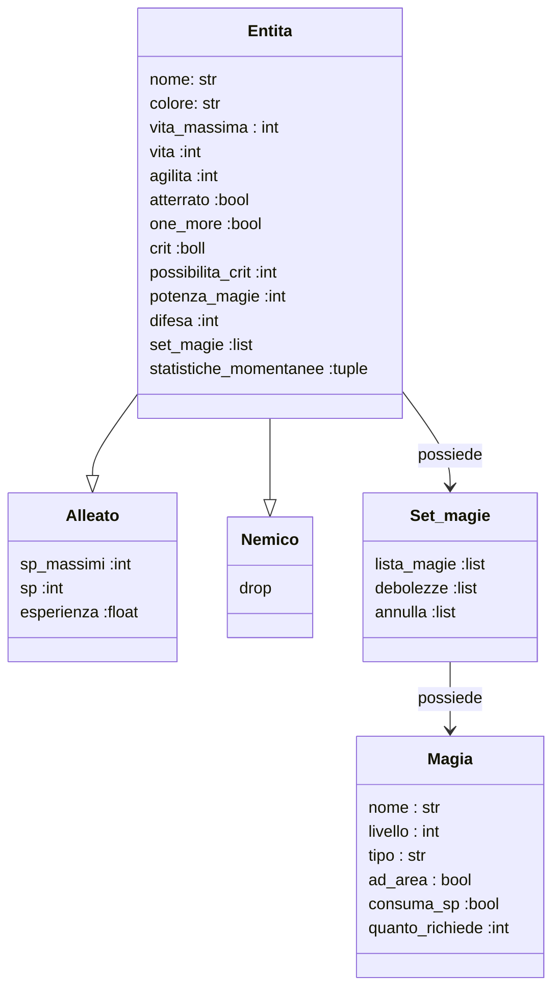

```mermaid
classDiagram
Entita --|> Alleato
Entita --|> Nemico
Entita --> Set_magie :possiede
Set_magie --> Magia :possiede
class Entita {
    nome: str
    colore: str
    vita_massima : int
    vita :int
    agilita :int
    atterrato :bool
    one_more :bool
    crit :boll
    possibilita_crit :int
    potenza_magie :int
    difesa :int
    set_magie :list
    statistiche_momentanee :tuple 
}

class Alleato {
    sp_massimi :int
    sp :int
    esperienza :float
}

class Nemico{
    drop
}

class Set_magie {
    lista_magie :list
    debolezze :list
    annulla :list
}

class Magia {
    nome : str
    livello : int
    tipo : str
    ad_area : bool
    consuma_sp :bool
    quanto_richiede :int
}
```